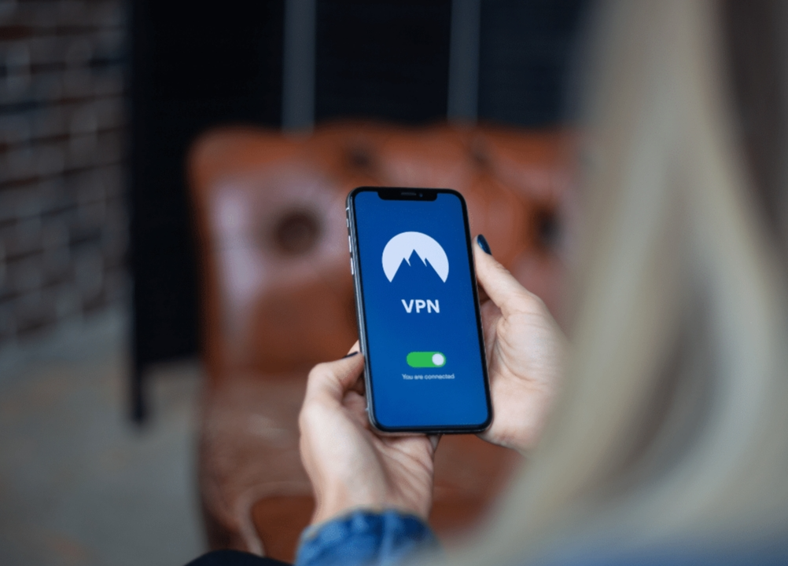
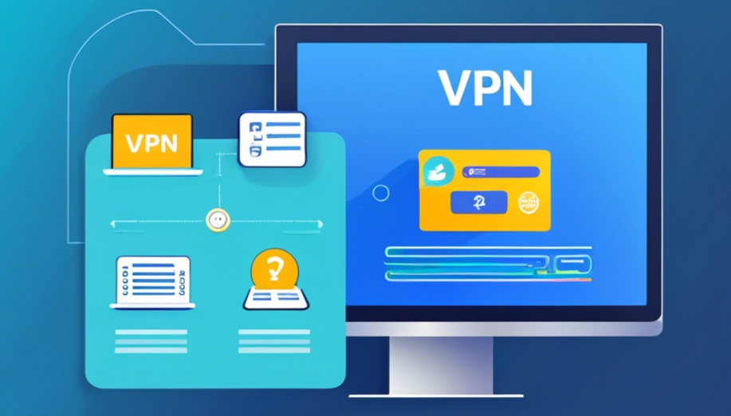

# 新手必看：VPN怎么开，三步上手

本文为初学者和流媒体用户详细讲解如何在手机、电脑和路由器上正确开启VPN，包含实操步骤、常见故障排查、路由器一键覆盖方案及安全提醒。

---
# 💡 为什么有人在搜“vpn怎么开”？

很多人搜索“vpn怎么开”其实是出于实际需求：保护上网隐私、访问公司内网、观看受地域限制的流媒体，或担心公共Wi‑Fi安全。新手不用担心，这篇文章会手把手教你从零开始学会怎么开VPN、在哪开、以及常见的坑怎么避。

---

## 本文内容

- 手机、电脑、路由器三种常见开启方法
- 常见问题排查与速度/隐私取舍
- 路由器一键覆盖场景（全家设备免装APP）
- 近期VPN相关事件与风险提示，帮你做更稳妥的选择

近年来，VPN流量和使用场景变化明显：比如某些网站下线会带来VPN注册潮，监管和法律环境也影响VPN的获取方式。其实开VPN很简单，按步骤来就行，遇到问题再逐条排查。

> 小提醒：文中提到的服务品牌仅作举例，不代表鼓励任何违规用途。使用VPN前请遵守当地法律和服务条款。

---

## 📊 不同设备“开VPN”对比表

| 设备         | 操作难度 | 隐私覆盖         | 速度影响      | 一次设置覆盖 |
|--------------|----------|------------------|---------------|--------------|
| 手机         | 低       | 单设备保护       | 小到中等      | 否           |
| 电脑         | 中       | 单设备/浏览器级  | 中等          | 否           |
| 路由器       | 高       | 全家设备保护     | 可能下降      | 是           |
| 浏览器插件   | 低       | 仅浏览器流量     | 最低          | 否           |

路由器方案最省心但门槛高，手机和浏览器插件适合临时需求或新手上手。选择时要平衡隐私范围、速度和操作复杂度。

---

## 😎 YouYou 经验分享

我是 YouYou，喜欢折腾各种VPN工具。从APP到路由器固件、流媒体解锁技巧都试过。总结一句：用对工具，VPN能省不少麻烦；用错工具，可能遇到广告、网速慢、甚至信息泄露。

VPN的作用：

- 隐私：防止公共Wi‑Fi泄露账号信息
- 安全：加密流量，降低被窃取风险
- 自由：访问受地域限制内容

如果你想省心又要速度和稳定性，可以评论留言给你推荐我测试很久的VPN。

---

## 💡 三种设备“开VPN”实操步骤

### 手机（Android / iOS）

## 一、手机开启VPN

1. **下载VPN应用**  
   在应用商店搜索并下载官方VPN APP（如 NordVPN、ExpressVPN、ProtonVPN 等）。

2. **注册并登录账号**  
   打开APP，注册或登录你的VPN账号。

3. **连接VPN服务器**  
   授权VPN配置（iOS会弹出系统确认，Android会请求VPN权限），选择合适的服务器节点，点击“连接”即可。连接成功后可通过浏览器访问“what is my ip”确认IP已变更。

4. **选择服务器**

   优先最近或流媒体专用节点

5. **点击“连接”**

   状态显示已连接后可用浏览器查“what is my ip”确认IP变化

## 二、电脑开启VPN（Windows / macOS / Linux）

1. **下载安装客户端**  
   前往VPN官网下载安装适用于 Windows、macOS 或 Linux 的客户端。

2. **登录并选择协议**  
   登录账号，选择推荐的协议（如 WireGuard、OpenVPN），通常 WireGuard 速度更快。

3. **连接并验证**  
   选择服务器，点击连接。连接成功后可通过“whatismyipaddress.com”确认IP变化。遇到问题可尝试切换协议或更换服务器。

4. **遇到问题**

   可切换协议、重启客户端或换近一点的服务器

## 三、路由器一键开启VPN（全家设备覆盖）

1. **确认路由器支持VPN**  
   检查路由器是否原生支持VPN或可刷第三方固件（如 OpenWRT、DD-WRT）。

2. **配置VPN连接**  
   登录路由器管理界面，找到“VPN”或“安全/高级”选项，上传VPN配置文件（如 .ovpn），填写账号密码，保存并启用。

3. **全网生效**  
   启动VPN后，家中所有连接路由器的设备都自动获得科学上网能力，无需单独安装APP。

## 路由器一键覆盖方案优势

- 一次设置，全家设备自动翻墙
- 适合智能电视、游戏主机等无法安装VPN客户端的设备
- 集中管理，隐私保护更全面
## 常见故障排查

- **无法连接**：检查账号、服务器状态和网络环境，尝试更换节点或协议。
- **速度慢**：优先选择距离较近的服务器，调整加密级别，优化路由器性能。
- **掉线频繁**：设置VPN自动重连，定期重启路由器，监控硬件温度。

> 路由器性能不足时速度可能下降，建议选支持VPN加密的路由器，可以参考下文教程。

(路由器翻墙详细教程：2025年最佳路由器VPN配置指南)https://vpnnew.net/article/luyouqi/

---

## ⚠️ 安全与风险提示

选VPN别只看“能连就行”。近期有假VPN和广告欺诈网络曝光，提醒大家警惕不良服务：有些免费或来路不明的VPN会插广告、记录数据，甚至恶意抽取流量。

法规和平台策略变化也会影响VPN使用（如某些内容平台下线后用户寻找替代访问方式）。

**实用建议：**

- 优先选有无日志政策、司法透明、第三方审计的服务商
- 避免来源不明的免费VPN，尤其是没有隐私政策或权限过多的APP
- 使用“Kill Switch”功能，防止VPN断线时流量泄露

---
## 通过以上三步，无论是手机、电脑还是路由器，都能轻松开启VPN，畅享安全、自由的互联网体验。

## 🙋 常见问题解答

**❓ 如何判断VPN是否生效？**  
打开浏览器，搜索“what is my ip”或访问 whatismyipaddress.com。显示的IP和你常用家庭/运营商IP不同，并显示为VPN所选国家/城市，则VPN已生效。

**🛠️ 连接失败/掉线怎么办？**  
换服务器或协议，确保系统时间同步。路由器部署时检查固件和CPU性能，必要时联系VPN客服获取专用配置。

**🧠 路由器开VPN后，部分设备不走VPN怎么设置？**  
看路由器是否支持“分流/Policy-based routing”或“VPN Bypass”功能。第三方固件支持按IP或MAC分流，可让特定设备直连不走VPN。

---

## 🧩 总结

- 新手最快上手：手机APP
- 电脑客户端中等
- 路由器一次设置最省心但最复杂
- 路由器方案适合全家保护或设备多的环境，但要考虑性能和配置难度
- 选VPN别只看免费，注意隐私政策、审计和口碑
- 实操技巧：用最近服务器、开启Kill Switch、优先高速协议（如WireGuard）

---