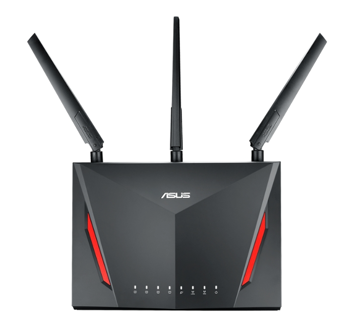
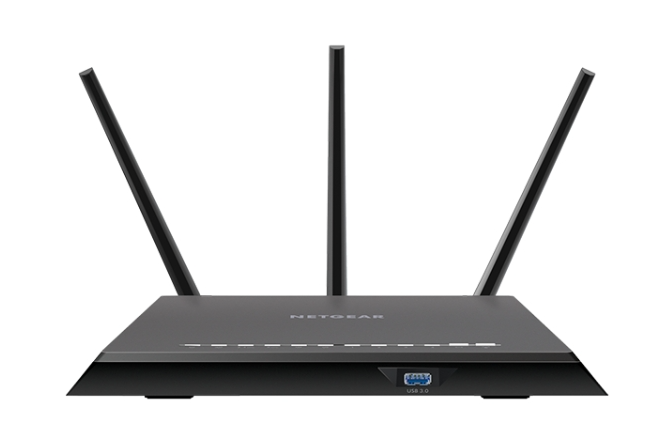
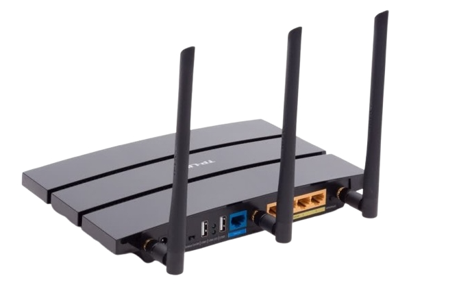
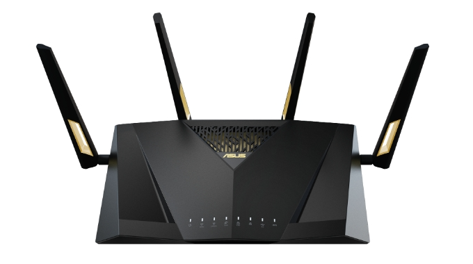
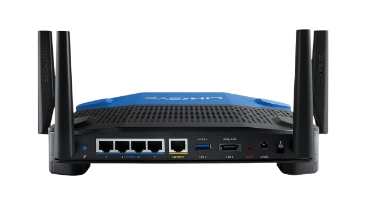
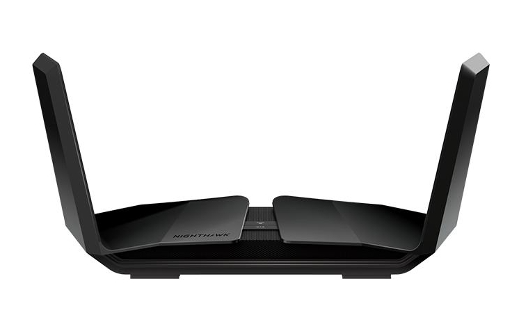
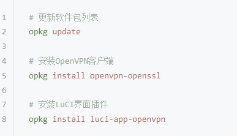

# 路由器翻墙详细教程：2025年最佳路由器VPN配置指南

> 本文系统介绍如何通过路由器配置VPN，实现全家设备科学上网。涵盖华为、小米、TP-Link等主流路由器的设置方法，并提供路由器选购建议与性能优化技巧。支持解锁Netflix、YouTube、ChatGPT等海外服务。

---

## 目录

- 一：路由器VPN翻墙的基本要求
- 二：路由器翻墙的主要优势
- 三：路由器翻墙的潜在限制
- 四：路由器VPN选择标准
- 五：最佳翻墙路由器设备推荐
- 六：华为路由器VPN配置教程
- 七：小米路由器翻墙设置方法
- 八：TP-Link路由器VPN安装指南
- 九：路由器翻墙方案总结

---

## 什么是路由器翻墙？

路由器翻墙指在无线路由器上配置VPN服务，让所有连接该路由器的设备都能通过加密通道访问被封锁的网站和服务。这样，手机、电脑、平板、智能电视、游戏机等设备都能自动获得科学上网能力，无需单独安装VPN客户端。

---

## 一：路由器VPN翻墙的基本要求

### 硬件兼容性

- 路由器需支持VPN客户端功能（如部分华硕、网件高端型号）
- 支持刷第三方固件（OpenWRT、DD-WRT、Merlin等）
- 具备足够的硬件性能以处理VPN加密

### VPN服务兼容性

- 选择支持路由器配置的VPN服务商
- VPN服务需提供OpenVPN或其他路由器兼容协议
- 确认VPN服务在中国大陆的连接稳定性

### 网络环境要求

- 稳定的宽带连接
- 充足的带宽支持VPN加密传输

---

## 二：路由器翻墙的主要优势

1. **全设备网络保护**  
   一次配置，全家设备自动获得VPN保护，无需单独安装软件。

2. **特殊设备翻墙**  
   智能电视、游戏主机、物联网设备等无法安装VPN客户端的设备也能科学上网。

3. **网络安全性提升**  
   所有流量加密传输，增强隐私保护，公共WiFi环境下也更安全。

4. **成本效益优化**  
   一个VPN账号即可保护多台设备，集中管理更经济高效。

---

## 三：路由器翻墙的潜在限制

- **技术门槛较高**：需要一定的路由器和网络配置知识，刷机有变砖风险。
- **硬件性能要求**：VPN加密解密消耗CPU资源，性能不足会影响网速。
- **使用灵活性有限**：更换VPN服务器需重新配置，分流功能有限，高级功能可能缺失。

---

## 四：路由器VPN选择标准

- **连接稳定性**：中国大陆连接成功率、重连能力、长时间稳定性
- **速度性能**：加密对网速影响、不同时间段速度表现
- **安全功能**：加密算法强度（推荐AES-256）、密钥交换安全性、无日志政策
- **兼容性**：主流路由器品牌支持、第三方固件兼容、协议支持（OpenVPN等）
- **服务质量**：客服响应速度、中文支持、价格合理性、退款政策

---

## 五：最佳翻墙路由器设备推荐

### 家庭用户推荐

- **ASUS RT-AC86U**：性价比高，配置简单

- **NETGEAR R7000**：稳定性好，社区资源丰富

- **TP-Link Archer C7**：入门级选择，价格亲民

### 高端用户推荐

- **ASUS RT-AX88U**：旗舰性能，WiFi 6支持

- **Linksys WRT3200ACM**：开源固件首选

- **NETGEAR Nighthawk系列**：企业级功能

---

## 六：华为路由器VPN配置教程

华为路由器大多不支持VPN客户端，但部分型号可通过内置VPN或刷OpenWRT实现。

### 支持型号

- WS5200四核版、AX3 Pro、AX6、WS7100、AX2、WS8200系列

### 配置方法

**方法一：内置VPN功能（部分型号）**

1. 登录管理界面（192.168.3.1 或 192.168.1.1）
2. 查找VPN设置（高级设置中）
3. 配置VPN连接（上传.ovpn文件，输入账号密码）

**方法二：刷OpenWRT固件（高级用户）**

1. 确认型号支持刷机，备份原厂固件
2. 刷入OpenWRT固件，重启路由器
3. 登录OpenWRT，安装OpenVPN插件，上传配置文件

**注意事项**

- 刷机有变砖风险，失去官方保修
- 华为路由器CPU性能较弱，建议选轻量级VPN协议

---

## 七：小米路由器翻墙设置方法

小米路由器采用基于OpenWRT的定制系统，官方固件一般不支持VPN客户端，但部分型号可通过刷第三方固件实现科学上网。

### 支持刷机型号

- 小米路由器3（R3）
- 小米路由器4（R4）
- 小米路由器AC2100
- 小米路由器AX1800
- 小米路由器AX3600
- 小米路由器AX6000

### 配置流程

#### 准备工作

- 下载适配的小米路由器OpenWRT固件
- 确认固件与路由器型号匹配
- 准备VPN服务商的配置文件
- 工具：SSH工具（如PuTTY）、网线、电脑浏览器

#### 详细步骤

1. 登录管理页面（192.168.31.1），在系统设置开启SSH并设置密码
2. 使用SSH连接路由器，上传OpenWRT固件，执行 `mtd write firmware.bin OS1` 刷机
3. 路由器重启后，访问新的管理界面，设置网络参数并安装必要软件包
4. 安装VPN客户端：

#### 第五步：配置VPN连接

- 将VPN配置文件上传至 `/etc/openvpn/`
- 在LuCI管理界面完成VPN连接设置
- 配置自动启动和网络路由规则，确保设备联网即自动翻墙

---

## 八：TP-Link路由器VPN安装指南

TP-Link部分型号原生支持VPN客户端，配置过程较为简便。

### 支持VPN的TP-Link型号

- Archer C7（V2-V5）
- Archer A7
- Archer C1200
- Archer AX50
- Archer C2300
- Archer AX73

### 原生VPN配置教程

#### 登录和基础设置

1. 在浏览器输入 `http://192.168.0.1` 或 `http://tplinkwifi.net`，进入路由器管理界面
2. 输入默认用户名和密码（一般为 admin/admin）

#### 查找VPN设置

- 点击“高级”菜单，选择“VPN客户端”或“VPN”选项
- 若无此选项，说明该型号不支持原生VPN

#### VPN连接配置

**OpenVPN方式：**

- 选择“OpenVPN”协议
- 上传 `.ovpn` 配置文件，系统自动解析参数
- 输入VPN服务商提供的用户名和密码
- 点击“连接”建立VPN通道

**L2TP/IPSec方式：**

- 选择“L2TP/IPSec”协议
- 手动填写服务器地址、用户名、密码、预共享密钥（PSK）
- 保存配置并启动连接

#### 连接测试与验证

- 在VPN客户端页面查看连接状态，确认显示“已连接”
- 记录分配的虚拟IP地址
- 访问Google、YouTube等网站，检测IP变化
- 测试网络速度，确保满足需求

### TP-Link第三方固件方案

对于不支持原生VPN的TP-Link型号，可考虑刷OpenWRT或DD-WRT固件。

#### OpenWRT固件安装

- 访问OpenWRT官网，确认设备支持列表及硬件版本
- 下载对应固件，备份原厂固件（非常重要）
- 准备TFTP服务器软件，设置电脑网络连接

**刷机过程：**

1. 路由器断电，按住Reset键
2. 通电同时继续按住Reset键约10秒
3. 通过TFTP上传OpenWRT固件
4. 等待安装完成并重启路由器

#### DD-WRT固件选择

- 图形界面友好，VPN配置简单，社区资源丰富
- 注意型号和硬件版本匹配，严格按照教程操作

### TP-Link路由器VPN优化技巧

#### 性能调优

- 选择合适的VPN加密强度，兼顾安全与速度
- 优化MTU参数，提升网络效率
- 监控CPU和内存使用率，避免资源瓶颈

#### 稳定性保障

- 设置VPN自动重连，提升连接稳定性
- 配置故障转移机制，确保网络不中断
- 定期重启路由器，保持系统流畅

---
## 九：路由器翻墙方案总结

### 路由器选择建议

**家庭用户优选：**
- ASUS RT-AC86U：高性价比，设置简便
- NETGEAR R7000：稳定可靠，社区资源丰富
- TP-Link Archer C7：入门级，价格实惠

**高端用户推荐：**
- ASUS RT-AX88U：旗舰性能，支持WiFi 6
- Linksys WRT3200ACM：开源固件首选
- NETGEAR Nighthawk系列：企业级功能

### 配置成功关键要素

**技术准备：**
- 确认路由器支持VPN功能
- 选择合适的VPN服务商
- 准备必要的技术工具

**配置流程：**
- 备份原始设置，防止数据丢失
- 按步骤完成VPN连接配置
- 测试连接稳定性，优化性能参数

**维护管理：**
- 定期检查VPN连接状态
- 及时更新路由器固件
- 监控网络性能表现，确保流畅运行

### 常见问题解决

**连接问题：**
- 检查VPN服务器状态
- 尝试切换连接协议
- 重置路由器网络设置

**速度问题：**
- 优先选择距离较近的服务器
- 调整VPN加密级别
- 优化路由器性能参数

**稳定性问题：**
- 设置VPN自动重连
- 监控路由器硬件温度
- 定期重启设备，提升稳定性

---

通过路由器科学上网，不仅能为家庭网络带来全面的隐私保护，还能自由访问全球内容。只要选对VPN服务和路由器型号，并按正确方法配置和维护，就能享受安全、稳定、高速的网络体验。

---
